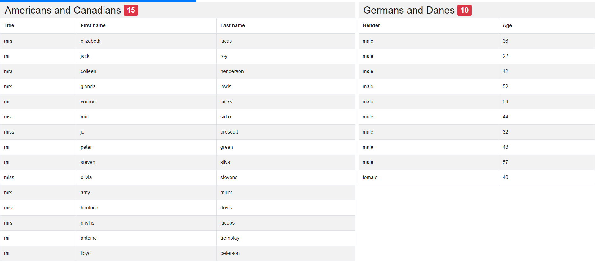

# Universal JSON API Health Monitor
This health monitor is intended to be used with an API which you intend to monitor closely. It provides a flexible way of configuring reports for API resources, for example an API which returns reports on the state of other mission-critical projects. This application expects JSON responses.



## Features
* Configure all your views and reports in a single JSON file; no additional programming required.
* Automatically switches between views after configured duration.
* Add as many reports as you like side-by-side in any view; you know your screen real estate.
* Supports transformation of API response data, such as converting fractions to readable percentages and trimming datetime strings. You can program additional transformations by extending the helper function in `src/utils.js`.

## Installation
To develop or build the health monitor, you need to:
* install Node and npm;
* clone this repo;
* install the project's dependencies with `npm run install`;
* create a `src/config.js` file (example file provided);
* create a `src/views.json` file (example file provided).

## Building the monitor
You can see the monitor in action by running `npm run start`, but you can also deploy it on a machine without a Node installation. For example, when you want to display the monitor on a large screen in your office, which is connected to a machine with just a browser and an internet connection.

To build the application, run `npm run build` (or `npm run build:staging` to build for your staging API instead).

## Running the monitor
The monitor can be run by launching `build/index.html` in a browser window. The application will automatically switch between the configured views and fetch fresh data from the configured endpoints. The API base URL must be defined in `src/config.js` as `apiBaseUrl`.

## Adding a new report or view
This monitor is designed in such a way that no new React components need to be created to compose new reports and views.

A **report** is defined as a table that contains the data of one health monitor API endpoint.

A **view** is defined as a collection of reports, displayed in a single viewport. Depending on the expected width of a report, you may use more than one report in a view. Using the `width` attribute, you can scale reports sharing a view.

You can find examples in `src/views.example.json`. The structure of `src/views.json` is as follows:

```
[ // array of view objects
    {
        "duration": 30, // view's duration in seconds before switch to next view
        "reports": [ // array of reports in this view
            {
                "endpoint": "/v1/health/endpoint",
                "params": { // object with key-value pairs for URL query string
                    "key": [ "404", "500" ] // value can be string or array of strings
                },
                "dataKeyPath" : "foo.bar.results", // specify the key of response object which contains your health report data, or leave blank ("") to use response object root
                "title": "Report Title",
                "width": 1,
                "columns": {
                    "DataKey1": { // key of API response object
                        "header": "Data Column 1", // title of the column
                        "transform": "none" // transform values before displaying (add support via `transform()` in `src/utils.js`)
                    },
                    "DataKey2.Deeply.NestedKey": { // keys can access nested objects of the API response
                        "header": "Data Column 2",
                        "transform": "none"
                    }
                }
            },
            [object Report], // views can support multiple reports
            [object Report]
        ]
    },
    [object View], // the monitor supports multiple views
    [object View]  // automatically switching based on view duration
]
```

# Important
After changing `src/views.json`, you must `npm run build` and deploy the contents of `build/`. You can build against the staging API by using `npm run build:staging` instead.
